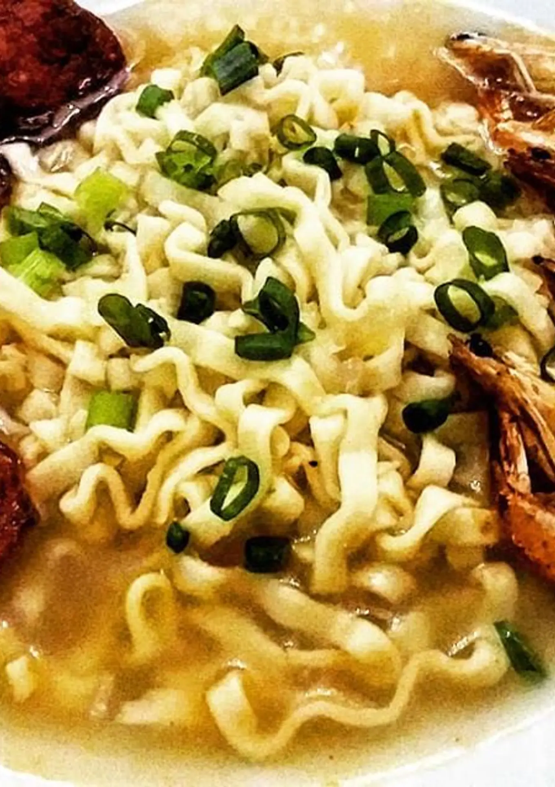

# Miojo Turbinado

## Descrição

A receita de **"Miojo Turbinado"** é um projeto simples de página **_html_** para o curso técnico de Desenvolvimento de Sistemas do SENAI Jandira.

_**Enjoy it!**_ 😉

## Tecnologias Utilizadas

- **HTML** para a estrutura da página.
- **CSS** para o estilo visual.
- **Font Awesome** para os ícones que numeram as etapas de preparo.

## Estrutura de Arquivos

- `index.html`: A página HTML com a receita.
- `style.css`: Arquivo de estilo para dar aquele visual todo especial.
- `foto.webp`: Imagem do prato pronto.

## Ingredientes

- 3 pacotes de miojo Lámen
- 1 pedacinho pequeno de gengibre bem picado
- 1/2 cebola picada
- 3 dentes de alho picado
- 3 linguiças calabresa cortadas em rodelas
- Camarões a gosto
- Páprica picante a gosto
- Ervas finas a gosto
- Cebolinha picada a gosto
- Sal e pimenta a gosto

## Instruções de Preparo

1. **Dourar as calabresas e reservar.**
2. **Dourar os camarões e reservar.**
3. **Dourar a cebola e logo em seguida os alhos.**
4. Em uma panela, adicionar a água, o miojo Lámen, a páprica e as ervas finas e cozinhar até a massa ficar pronta.
5. **Servir com as calabresas, os camarões e salpicar com cebolinha picada.**

## Licença

Este projeto está licenciado sob a Licença MIT - veja o arquivo [LICENSE](https://pt.wikipedia.org/wiki/Licen%C3%A7a_MIT) para mais detalhes.
